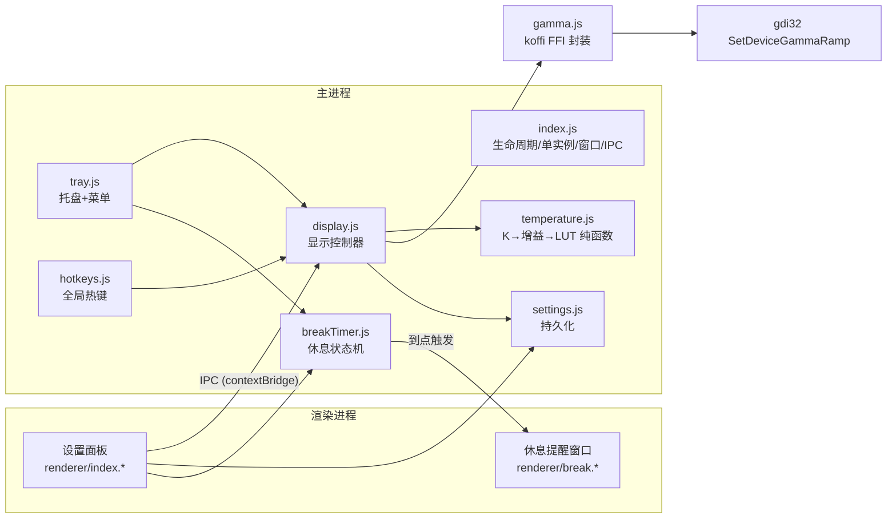

# 护眼助手（EyeGuard）— 设计文档

- 日期：2026-10-01
- 状态：设计已获用户批准（对话确认），待审阅本文档
- 项目路径：`D:\Users\Admin\Desktop\天枢\护眼`

## 1. 需求提炼

**目标**：为每天长时间办公盯屏的用户提供一个 Windows 桌面护眼工具。核心能力：屏幕色温调节（防蓝光）；辅以亮度调节与定时休息提醒。产品体验对标 CareUEyes 的核心功能集。

**用户故事**：
1. 屏幕色温可调暖（2000K–6500K），实时生效、平滑过渡。
2. 预设一键切换不同场景（办公 / 健康 / 夜晚 / 关闭）。
3. 定时被提醒休息眼睛，但提醒可推迟、可跳过，不粗暴打断。
4. 随时可「恢复原色」（做设计、看图时不受色偏干扰），退出应用后屏幕色彩 100% 还原。

**非目标（首版不做，YAGNI）**：聚焦模式、窗口暗黑/灰度（魔法X）、用眼统计报表、日出日落自动跟随、多显示器独立调节、全屏应用检测、强制锁屏。

**成功标准**：
- 调节即时生效（拖动滑块视觉反馈 < 100ms）。
- 退出/崩溃后屏幕色彩必然恢复（含异常兜底）。
- 休息提醒按设定节奏工作，可推迟/跳过。
- 打包为便携版 exe，双击即用，可开机自启。

## 2. 技术选型与验证结论

- 运行时：**Electron 44.5.1**（本机 Node 24 环境就绪；二进制已下载缓存于探针目录）。
- 色温引擎：**koffi 3.3.2 FFI → gdi32.dll `Get/SetDeviceGammaRamp`**（GPU gamma ramp 偏移，全屏生效，与 f.lux / CareUEyes 同原理）。
- 语言：**纯 JavaScript（CommonJS）**，无 TypeScript、无构建步骤（项目规模不需要，减少依赖与下载量）。
- 测试：**node:test**（Node 内置，零依赖）。
- 打包：**@electron/packager**（便携版；需要安装程序时再评估 electron-builder）。

**已实测证据（2026-10-01，双探针）**：

| 验证项 | 结果 | 证据 |
|---|---|---|
| koffi → SetDeviceGammaRamp 读写链路 | ✅ PASS | 蓝色通道 65535→42598 写入成功（=65535×0.65 精确匹配），读回一致，恢复成功，exit=0 |
| Electron 44.5.1 主进程加载 koffi | ✅ PASS | `[[ELECTRON_PROBE_RESULT]] PASS \| napi=10 \| B[255]=65535` |
| 零编译工具链 | ✅ PASS | koffi 二进制来自 `@koromix/koffi-win32-x64` 预编译包，无需 node-gyp / VS Build Tools |

**已知约束与对策**：

| 约束 | 对策 |
|---|---|
| 本环境 npm 11.19 拦截 install scripts（审批机制） | setup 时 `npm install-scripts approve electron` 或手动补二进制（附录 A） |
| Electron 二进制下载曾连接重置 | curl 断点续传 + PowerShell 解压（附录 A）；本机已有 44.5.1 缓存可复用 |
| 部分显卡驱动限制 gamma ramp 低值（社区案例 <50% 失败） | 亮度下限 50% + 写入失败回退（§5.4） |
| 多显示器：gamma ramp 按显示器设备独立生效 | 本机单显示器实测通过；多屏逐显示器支持**未验证**，列入后续迭代 |
| gamma ramp 可能被驱动/全屏应用重置 | 守护定时校验并重应用（§5.5） |

## 3. 功能规格

### 3.1 色温调节（核心）
- 范围 2000K–6500K，步进 100K；**6500K = 无偏移原色**。
- 滑块拖动实时生效；数值变化平滑（LUT 直接更新，无动画帧需求）。
- 预设：办公 4500K / 健康 3400K / 夜晚 2700K / 关闭（=6500K）。
  > **参数修订注（2026-10-01）**：预设值已依据专项调研更新为 办公 5500K / 傍晚 4500K / 夜晚 3400K / 深夜 2700K，
  > 依据与来源见 `docs/eye-parameters-research.md`。本节保留原始设计记录。
- 记忆上次设置，下次启动自动恢复。

### 3.2 亮度调节
- 范围 50%–100%，100% = 无变化；与色温增益**乘法叠加**。
- 驱动拒绝写入时回退上一有效值并在 UI 提示（§5.4）。

### 3.3 定时休息提醒
- 周期（可配置）：默认工作 40 分钟 → 提醒 → 休息 5 分钟 → 循环；内置「20-20-20」快速预设（20 分钟 / 20 秒）。
- 提醒样式（设置可切）：
  - **温和（默认）**：屏幕中央悬浮卡片 420×320，不抢键盘焦点（`showInactive`），按钮 [开始休息] [推迟 5 分钟] [跳过]。
  - **强制**：全屏置顶遮罩 + 大号倒计时，[推迟] [跳过] 保留但视觉弱化（不锁屏、不拦截输入）。
- 到点只弹一次；用户处理后按状态机流转（§5.6）。

### 3.4 托盘与全局热键
托盘右键菜单：

```
护眼助手
├─ 预设：办公 4500K ✓ / 健康 3400K / 夜晚 2700K / 关闭
├─ 色温 +200K / 色温 −200K
├─ 恢复原色（临时关闭护眼色彩） / 重新启用
├─ 暂停提醒 1 小时 / 恢复提醒
├─ 设置…
├─ 开机自启 ✓
└─ 退出
```

- 左键单击托盘 = 打开设置面板；关闭设置面板 = 隐藏到托盘（不退出）。
- 全局热键（默认）：`Ctrl+Alt+↑` 色温 +200K，`Ctrl+Alt+↓` 色温 −200K；可配置；注册失败时不阻塞启动，设置页提示。

### 3.5 设置面板（主窗口）
- 420×560 小窗，中文界面；四个区块：
  1. 色温：滑块 + 当前 K 值 + 预设按钮组
  2. 亮度：滑块 + 百分比
  3. 休息提醒：开关 + 工作时长 + 休息时长 + 样式选择
  4. 通用：开机自启开关、热键说明、[恢复原色] 按钮

### 3.6 安全恢复（内核保障）
- 启动时读取并存档原始 gamma ramp（内存 + 磁盘双备份）。
- 正常退出：恢复原始 ramp 后再退出。
- 崩溃/强杀后下次启动：检测脏标记 → 先恢复 → 再正常工作。
- 设置页「恢复原色」一键操作；托盘同项。

## 4. 架构



**组件职责（均为 `src/main/` 下平铺，文件名即模块名）**：

| 文件 | 职责 | 依赖 |
|---|---|---|
| `index.js` | 应用生命周期、单实例锁、窗口管理、IPC 路由、开机自启 | 其余全部 |
| `gamma.js` | koffi FFI 底层封装：`readRamp()` / `writeRamp()` / `resetToOriginal()` | koffi |
| `temperature.js` | 纯函数：色温 K→RGB 增益、增益+亮度→LUT | 无 |
| `display.js` | 显示控制器：备份/恢复、应用 LUT、失败回退、ramp 守护 | temperature, gamma, settings |
| `breakTimer.js` | 休息状态机、暂停/推迟/跳过 | settings |
| `tray.js` | 托盘图标与菜单、状态勾选 | display, breakTimer |
| `hotkeys.js` | globalShortcut 注册/注销/冲突提示 | display |
| `settings.js` | settings.json 读写（userData）、损坏自愈 | fs |
| `preload.js` | contextBridge 暴露白名单 IPC API | — |
| `renderer/index.*` | 设置面板 UI | preload API |
| `renderer/break.*` | 休息提醒窗口 UI | preload API |

**数据流**：滑块 → IPC `set-temperature(K)` → display 计算 LUT → gamma 写 GPU → 状态回播 UI；任何变更 → settings.json 持久化。

## 5. 关键机制设计

### 5.1 色温算法（黑体近似，6500K 归一）

```
K' = K / 100
R(K) = K' ≤ 66 ? 255 : 329.698727446 · (K'−60)^(−0.1332047592)
G(K) = K' ≤ 66 ? 99.4708025861 · ln(K') − 161.1195681661
              : 288.1221695283 · (K'−60)^(−0.0755148492)
B(K) = K' ≥ 66 ? 255 : K' ≤ 19 ? 0 : 138.5177312231 · ln(K'−10) − 305.0447927307
gain[c] = clamp(RGB_c(K) / RGB_c(6500), 0, 1)
```

- 以 6500K 为参考白点归一 ⇒ `gain(6500) == (1,1,1)` 精确成立（单测断言）。
- 只在 [0,1] 内衰减，不做 >1 增益（避免溢出与增亮）。
- 参考值：2700K ≈ (1.0, 0.66, 0.35)；4500K ≈ (1.0, 0.88, 0.62)（以单测固化）。

### 5.2 LUT 生成（原始值保护）

```
final[c][i] = clamp(round(orig[c][i] · gain_temp[c] · gain_brightness), 0, 65535)
```

- 基底是**启动时存档的原始 ramp**（而非理论线性值）——保留用户显示器的硬件校准。
- 恒等式：6500K + 100% 亮度 ⇒ 输出与原始值逐字节一致（单测断言）。

### 5.3 备份与恢复

- 磁盘备份文件 `gamma-backup.json`（userData 目录）：`{ savedAt, dirty, ramp: number[768] }`。
- 首次运行：读取当前 ramp 存档。每次应用 LUT 前 `dirty=true`；正常恢复后 `dirty=false`。
- 启动自愈：`dirty=true` ⇒ 上次未正常恢复 ⇒ 先用备份还原屏幕，再进入正常流程。
- 退出路径：`before-quit` 恢复 → 写 `dirty=false` → 退出。

### 5.4 失败回退

`SetDeviceGammaRamp` 返回 0（驱动拒绝）时：立即还原上一有效 LUT → IPC 通知 UI「该数值超出当前显卡驱动支持范围」→ 滑块回弹到上一有效值。色温与亮度两条路径均受此保护。

### 5.5 Ramp 守护（Watchdog）

gamma ramp 可能被驱动重置（分辨率切换、全屏独占应用、HDR 切换、睡眠唤醒）：
- 每 15 秒校验一次：`readRamp()` 与期望 LUT 比对，不一致则重写（单次 FFI 调用，开销可忽略）。
- 事件触发：`powerMonitor` resume / `screen` display-metrics-changed → 立即重应用。
- 期望 LUT 为「原始值 + 当前增益」的重算结果；未启用护眼色彩时不干预。

### 5.6 休息状态机

```
working --计时到--> alerting --[开始休息]--> resting --倒计时到--> working(完整计时)
   ^                   |--[推迟5分钟]--> working(短计时 5min)
   |                   |--[跳过]------> working(完整计时)
   +--[暂停至 t]--< [恢复] （暂停期间不触发；恢复后重算剩余）
```

- 计时器基于时间戳（非 tick 累计），睡眠/唤醒后时间计算仍正确。
- 提醒窗口仅存在于 alerting / resting 阶段；resting 阶段显示倒计时。
- 用户闲置不特殊处理（最坏情况：回来只见一个待处理提醒窗，可接受；闲置检测列入后续）。

### 5.7 单实例与自启

- `requestSingleInstanceLock()`：第二个实例启动时唤醒已有实例的设置窗并退出自身。
- 自启：`setLoginItemSettings({ openAtLogin, args: ['--hidden'] })`；`--hidden` 启动仅驻留托盘。

## 6. 测试策略

| 层 | 方法 | 位置 |
|---|---|---|
| 色温/增益/LUT 纯函数 | 单测：6500K 恒等、增益单调性、边界 K 值 | `tests/temperature.test.js` |
| 备份/恢复/脏标记逻辑 | 单测（注入假 ramp IO） | `tests/backup.test.js` |
| 休息状态机 | 单测（假时钟） | `tests/breakTimer.test.js` |
| FFI 集成 | 脚本：读→写→读回→恢复（真实 GPU） | `scripts/gamma-selftest.js` |
| 端到端 | 交付前手动清单：托盘/滑块/提醒/退出恢复 | 人工走查 |

运行：`npm test`（node --test）；集成：`npm run selftest`。

## 7. 里程碑（波次）

| 波 | 内容 | 完成判据 |
|---|---|---|
| W1 | 骨架：package.json、index.js、单实例、托盘图标、空设置窗口 | `npm start` 出托盘 + 窗口，可退出 |
| W2 | 色温核心：gamma.js、temperature.js、display.js、备份恢复、滑块 UI | 单测绿 + selftest 绿 + 拖动实时生效 + 退出恢复 |
| W3 | 亮度、预设、全局热键、设置持久化 | 各功能手动验证 + 单测绿 |
| W4 | 休息提醒：状态机、提醒窗口、暂停/推迟/跳过 | 状态机单测绿 + 缩短周期实测一轮 |
| W5 | 开机自启、@electron/packager 打包、图标、README | 打包产物双击运行 + 退出后色彩恢复验证 |

## 8. 风险清单

| 风险 | 等级 | 对策 |
|---|---|---|
| 显卡驱动不支持 gamma 写入 | 中 | 首次应用失败即提示；功能降级为「仅提醒」并明确告知 |
| 崩溃后屏幕偏色滞留 | 低 | dirty 标记 + 启动自愈（§5.3） |
| 全局热键被占用 | 低 | 注册失败不阻塞，设置页提示改键 |
| Electron 安装环境特殊（install-scripts 拦截 / 下载不稳） | 中 | 附录 A 固化可复现步骤；二进制缓存已在本机 |
| 打包体积 ~230MB | 低 | 接受（Electron 桌面应用常态）；如需瘦身后续评估 |

## 附录 A：本机环境特殊操作（已实测可复现）

1. **Electron 二进制缺失时**（install scripts 被 npm 拦截）：
   - 优先：`npm install-scripts approve electron` → 重装/`npm rebuild electron`；
   - 或手动：curl 断点续传下载 `https://cdn.npmmirror.com/binaries/electron/44.5.1/electron-v44.5.1-win32-x64.zip`（约 150MB）→ PowerShell `Expand-Archive` 解压至 `node_modules/electron/dist/` → 以**无换行**方式写 `node_modules/electron/path.txt`（内容：`electron.exe`）。
   - 本机已有缓存可复用：`D:\Users\Admin\Desktop\天枢\护眼\.rivet\scratch\gamma-probe\electron.zip`。
2. **koffi** 无需任何处理（`@koromix/koffi-win32-x64` 预编译包随 npm 安装自动就位）。
3. **打包时**：`asarUnpack` 必须包含 `**/node_modules/@koromix/**`（.node 二进制不能留在 asar 内）。
4. npm 若因网络改用镜像：`npm config set registry https://registry.npmmirror.com` 或用 `--registry` 参数（不修改全局配置时）。

## 附录 B：settings.json 结构

```json
{
  "enabled": true,
  "temperature": 4500,
  "brightness": 100,
  "preset": "office",
  "breaks": { "enabled": true, "workSeconds": 2400, "breakSeconds": 300, "style": "gentle" },
  "hotkeys": { "tempUp": "Control+Alt+Up", "tempDown": "Control+Alt+Down" },
  "autoLaunch": false,
  "pausedUntil": null
}
```

（`preset` 取值：`office | health | night | off | custom`；`style` 取值：`gentle | fullscreen`。）
