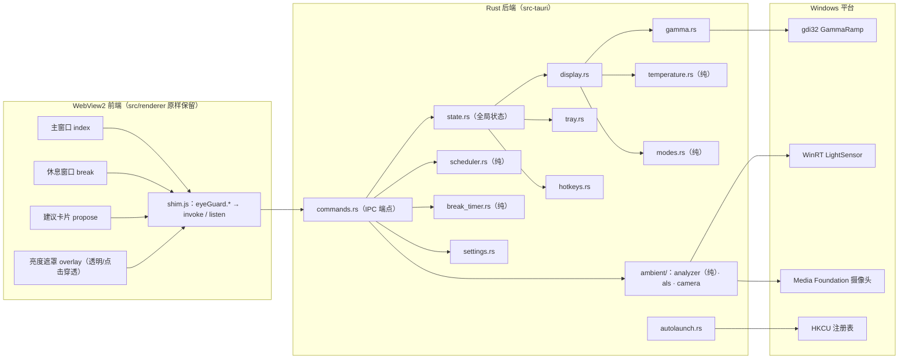

# 护眼助手 Rust/Tauri 2 重写 — 设计文档

- 日期：2026-10-01
- 状态：待用户审阅
- 前置：`docs/superpowers/specs/2026-10-01--design.md`（v1）、`2026-10-01--v2-design.md`（v2＝Electron 版功能终态）
- 本版主题：**全量重写为 Rust/Tauri 2 ｜ 构建打包迁至 GitHub Actions ｜ 仓库公开**

## 1. 需求提炼

**用户原话**：

1. 「护眼用rust重写一遍，构建和打包走github的ci」
2. 「公开仓库」「安装器 + 便携版都要」
3. （澄清选项）UI 层走 **Tauri 2 路线**：Rust 重写全部逻辑层，前端保留现有 HTML/CSS/JS

**目标**：

- Electron/Node.js → Rust/Tauri 2 **全量重写，功能对等**：7 档模式 / 色温 2000–10000K / 亮度 / 时间调度 / 感光监测 / 定时休息 / 托盘 / 热键 / 开机自启 / 三主题 / 崩溃自愈——全部保留。
- **构建与打包 100% 由 GitHub Actions 完成**：push 触发「测试 + 构建」（产物存档），tag `v*` 触发「正式发布」（NSIS 安装器 + 便携 zip 双附件）。
- 仓库已公开（2026-10-01 切换，本机 `gh repo view` 实测 `visibility: PUBLIC`）——公开仓库的 Actions 用量免费，CI 额度不构成约束。

**非目标（本版不做，YAGNI）**：

- 自动更新器（updater）——后续独立迭代
- MSI 等其他安装形态
- 多显示器独立调节（延续 v1/v2 已知边界）
- **任何新功能**（功能集冻结；纯移植，bug 修复除外）
- macOS/Linux 支持（保持 Windows 专用）

## 2. 总策略

- **纯移植、行为冻结**：所有行为语义以 v2 版为准；`tests\` 下 93 个用例为行为契约，按 §6 分类处理（对照移植 / 前端保留 / 协议退役）。
- **分支策略**：`rust` 分支开发；master（Electron 版）冻结可回退。每波完成判据 = `cargo test` 全绿 + 对应实机走查。
- **发布**：全部验收后合并 master，打 tag `v0.2.0`（Electron 版为 0.1.0），CI 产出双形态并发布 Release。

## 3. 架构

### 3.1 总览



### 3.2 模块映射（现 `src\main\*.js` → `src-tauri\src\`）

| 现有模块 | Rust 模块 | 方式 | 迁移要点 |
|---|---|---|---|
| `temperature.js` | `temperature.rs` | 直译（纯函数） | 黑体近似、6500K 归一、冷暖双向反解、`buildSafeLut` 50% 钳制——语义逐行保真，测试全量对照 |
| `modes.js` | `modes.rs` | 直译（纯数据） | 7 档模式表原样 |
| `scheduler.js` | `scheduler.rs` | 直译（纯函数） | 窗口命中 / 防重 / 启动对齐 / 时钟回拨防护 |
| `ambient.js`（分析） | `ambient\analyzer.rs` | 直译（纯逻辑） | EMA α=0.3、P75 基线（仅 normal 更新）、回滞、冷却 |
| `breakTimer.js` | `break_timer.rs` | 直译（状态机） | 时间戳基准、跨睡眠正确 |
| `settings.js` | `settings.rs` | 直译 + serde | 深合并 / 损坏自愈 / 原子写（tmp+rename）/ v1→v2 迁移 |
| `gamma.js` | `gamma.rs` | 平台重写 | koffi → `windows` crate 直绑 gdi32（GetDC/Get/SetDeviceGammaRamp）；DC 缓存复用；768×u16 |
| `als.js` | `ambient\als.rs` | 平台重写 | PowerShell 桥 → `windows` crate 直调 WinRT `LightSensor`（省 0.3–1s/次进程启动） |
| `ambient.js`（采样）+ camera 窗口 | `ambient\camera.rs` | 平台重写 | **nokhwa 探针**：Rust 直抓帧→64×64 luma；探针不过则回退 WebView2 `getUserMedia` + 隐藏窗口（现架构） |
| `display.js` | `display.rs` | 平台重写（逻辑保真） | 原始 ramp 双备份（内存+`gamma-backup.json`）、夹逼回退（+4096×8）、dirty 自愈 |
| `overlay.js` | `overlay.rs` | 平台重写 | Tauri 透明窗口 + `set_ignore_cursor_events(true)` |
| `hotkeys.js` | `hotkeys.rs` | 插件 | 官方 `tauri-plugin-global-shortcut`；键位默认不变（Ctrl+Alt+↑↓） |
| `tray.js` | `tray.rs` | 核心 API | `TrayIconBuilder` + 菜单（7 档模式子菜单、暂停、恢复原色、退出） |
| 自启（index.js 内） | `autolaunch.rs` | 插件 | 官方 `tauri-plugin-autostart`；**注册表项名与 Electron 版不同，升级用户需重新勾选一次**（README 说明） |
| 单实例（index.js 内） | — | 插件 | 官方 `tauri-plugin-single-instance` |
| `index.js`（30KB 编排） | `main.rs` / `lib.rs` / `state.rs` / `commands.rs` | 重写 | 保留 `applyMode` 单一入口、启动对齐、IPC 路由、主题广播等语义 |

### 3.3 前端保留策略（零重画 + 薄 shim）

- `src\renderer\` 全部文件**原样保留**（三主题 CSS、立绘、星点背景、糖果按钮、动画——零重画）。
- 新增 `src\renderer\shim.js`：以同名 `window.eyeGuard.*` 包装 Tauri 调用：
  - `tauri.conf.json` 开启 `app.withGlobalTauri = true` → `window.__TAURI__.core.invoke` / `window.__TAURI__.event.listen` 直接可用，**前端保持无构建**（无需 npm / 打包器 / Vite）。
  - 20 条 API 逐项映射（见 §3.5）；**事件名保持不变**（`break:update` / `display:changed` / `theme:changed` / `propose:update` / `ambient:state`），前端业务 JS 只改 1 处（各 HTML 增加一行 `<script src="shim.js">`）。
- `tauri.conf.json` 的 `frontendDist` 指向 `..\src\renderer`。

### 3.4 窗口矩阵

| 窗口 | 参数（延续现版） | 创建方式 |
|---|---|---|
| main 设置面板 | 440×680 | `tauri.conf.json` 预定义 |
| break 休息窗口 | 温和卡片 / 全屏遮罩两样式；alwaysOnTop、skipTaskbar、不抢焦点 | Rust 侧 `WebviewWindowBuilder` 动态 |
| propose 建议卡片 | 400×190 悬浮、`showInactive` | Rust 动态 |
| overlay 亮度遮罩 | 全屏透明、点击穿透、不抢焦点 | Rust 动态 |
| camera 隐藏测光窗口 | **条件砍除**：nokhwa 探针成立则整体删除（Rust 直采样） | — |

### 3.5 IPC 契约（preload.js 20 条 → Tauri）

| `window.eyeGuard.*` | Tauri 侧 | 类型 |
|---|---|---|
| `getVersion` | `app_get_version` | command |
| `getDisplayState` | `display_get_state` | command |
| `setTemperature` | `display_set_temperature` | command |
| `setBrightness` | `display_set_brightness` | command |
| `restoreColor` | `display_restore` | command |
| `listModes` | `modes_list` | command |
| `applyMode` | `modes_apply` | command |
| `getSettings` | `settings_get` | command |
| `updateSettings` | `settings_set` | command |
| `setAutoLaunch` | `app_set_auto_launch` | command |
| `getAutoLaunch` | `app_get_auto_launch` | command |
| `getBreakState` | `break_get_state` | command |
| `breakAction` | `break_action` | command |
| `proposeAction` | `propose_action` | command |
| `getAmbientState` | `ambient_get_state` | command |
| `onPropose` | `propose:update` | event |
| `onAmbientState` | `ambient:state` | event |
| `onBreakUpdate` | `break:update` | event |
| `onDisplayChanged` | `display:changed` | event |
| `onThemeChanged` | `theme:changed` | event |

## 4. 平台关键实现

### 4.1 色温（gamma.rs + display.rs）

- `windows` crate：`GetDC(null)` 缓存复用；`GetDeviceGammaRamp` / `SetDeviceGammaRamp`（768×u16）。
- 保留语义：`buildSafeLut` 每通道 max ≥ 32768 保护（50% 规则）；写入被拒时安全边界 +4096 夹逼重试（≤8 次）；彻底失败回退上一有效 LUT；`dirty` 标记（应用前置位、恢复/自愈清位）。
- 等价物：`scripts\gamma-selftest.js` → `cargo` 集成探针（真实屏幕短暂变色后复原，含 8000K/10000K 冷区用例）。

### 4.2 ALS（ambient\als.rs）

- `windows` crate `Windows.Devices.Sensors.LightSensor`：`GetDefault()` 为 null → 无硬件（回退摄像头）；`GetCurrentReading()` → lux。
- 判定协议与现版一致：无硬件 / 无读数 / 有效读数三态。

### 4.3 摄像头测光（ambient\camera.rs）

- **首选**：nokhwa（Media Foundation 后端）直接抓帧 → 64×64 降采样 → 感知亮度 luma → 立即释放设备；单次采样目标 < 1.2s。
- **探针先行**（W3 首个动作）：验证抓帧成功率 / 单次耗时 / 设备释放干净 / 被占用时优雅失败；不过则回退「WebView2 getUserMedia + 隐藏窗口」现版架构。
- 隐私边界不变：默认关闭、画面仅算 luma、不保存不传输。

### 4.4 系统集成

- 托盘：7 档模式子菜单 / 色温微调 / 恢复原色 / 暂停 1 小时 / 退出。
- 热键：`Ctrl+Alt+↑/↓` 色温 ±200K（可配置字段保留）。
- 自启：`tauri-plugin-autostart`（注册表 HKCU Run，项名与 Electron 版不同——升级用户重新勾选一次，写入 README 升级说明）。
- 单实例：第二实例唤起既有主窗口。

### 4.5 数据迁移（重要）

- 数据目录**沿用** `%APPDATA%\护眼助手\`（Electron userData 路径）：`settings.json`、`gamma-backup.json` 无缝继承——用户主题/调度/感光/休息配置零丢失。Rust 侧显式指定数据目录（不用 Tauri 默认的 identifier 目录）。
- `settings.rs` 保留：深合并、损坏自愈、原子写；v1→v2 迁移逻辑（preset→modeId）保留以兼容更老配置。
- 启动时 `dirty=true` → 先恢复原始色彩（崩溃自愈语义不变）。

## 5. 迁移波次

| 波 | 内容 | 完成判据（验证） |
|---|---|---|
| **W1 基建** | `rust` 分支；`src-tauri` 脚手架（conf / capabilities / 四窗口定义 / 插件注册）；CI 骨架；空套件跑通 | CI workflow 全绿；本地 `cargo test` exit 0 |
| **W2 显示核心** | gamma / temperature / modes / settings / display + 显示类 commands + shim + 主窗口接线 | 对照单测全绿；实机：拖动色温滑块 → 读回生效；重启后 dirty 自愈 |
| **W3 调度+感光** | scheduler / ambient（analyzer·als·camera）+ propose 卡片窗口 | 对照单测全绿；摄像头探针报告；60s 实测「挡摄像头 → 触发提醒」 |
| **W4 系统集成** | break_timer + 休息窗口；tray；hotkeys；autolaunch；overlay 遮罩 | 对照单测全绿；实机走查：托盘 7 档 / 热键 / 遮罩 / 休息卡片 / 自启重启读回 |
| **W5 发布收尾** | NSIS + 便携 zip 打包；tauri-action 发布；Electron 代码清理；README/usage 更新；合并 master；tag `v0.2.0` | CI 双产物下载安装实测；全量回归；三项交付报告 |

## 6. 测试策略

| 层 | 方法 | 定位 |
|---|---|---|
| 逻辑层 | **对照移植**：temperature / modes / scheduler / ambientAnalyzer / breakTimer / settings / backup（7 文件全量用例 → Rust `#[test]`） | `src-tauri`（内嵌 `#[cfg(test)]` 或 `src-tauri\tests\`） |
| 前端契约 | **保留**：theme 的 3 个纯前端用例（三窗口 CSS 覆盖块 / 按钮集合 / THEMES 白名单）继续 node:test，CI 增一步 | `tests\theme.test.js`（裁剪保留） |
| 语义替代 | als 的 8 个用例（PowerShell 解析协议）随桥退役 → Rust「无硬件/无读数/有效读数」三态测试替代；theme 持久化用例 → Rust settings 测试覆盖 | — |
| 平台链路 | gamma selftest 等价物（真实屏幕短变色复原，含冷区） | `src-tauri\tests\`（ignored by default，手动跑） |
| UI 视觉 | 三主题 × 各窗口截图矩阵（人工走查起步；smoke-shot 迁移列为后续项） | 手动 |
| 端到端 | 实机清单：托盘 / 热键 / 调度弹卡 / 感光 / 休息 / 自启读回 / 崩溃自愈 | 手动 |

## 7. CI 设计（`.github\workflows\build.yml`）

```yaml
name: build
on:
  push:
    branches: [master, rust]
    tags: ["v*"]
  workflow_dispatch:
concurrency:
  group: ${{ github.workflow }}-${{ github.ref }}
  cancel-in-progress: true
jobs:
  test:    # windows-latest + dtolnay/rust-toolchain@stable + Swatinem/rust-cache
           # cargo test --manifest-path src-tauri/Cargo.toml
  build:   # needs test；tauri-apps/tauri-action 构建；upload-artifact：
           #   NSIS 安装器 + 便携 zip（release exe + icon + 使用说明，Compress-Archive）
  release: # if tag v*；tauri-action 发布 GitHub Release（自动附双产物 + tag notes）
```

- 便携 zip = `Compress-Archive`（指向 `src-tauri\target\release\eye-guard.exe` + 说明文档）。
- NSIS 安装器由 Tauri bundler 内置产出，**内嵌 WebView2 bootstrapper**（缺环境的机器安装时自动补装）。
- 仓库公开 → Actions 免费无限量；保留 rust-cache 以压缩单次跑时。

## 8. 本机环境准备（开发用，一次性）

| 组件 | 安装方式 | 用途 |
|---|---|---|
| rustup + MSVC 工具链 | `winget install Rustlang.Rustup` | rustc / cargo 本地编译 |
| VS Build Tools 2022（VCTools 工作负载） | `winget install Microsoft.VisualStudio.2022.BuildTools`（override 加 VCTools） | MSVC 链接器（Rust Windows 默认目标） |
| WebView2 Evergreen Runtime | `winget install Microsoft.EdgeWebView2Runtime` | 本地运行 / 调试 Tauri 应用 |
| cargo 网络 | `~\.cargo\config.toml`：`http.proxy = "http://127.0.0.1:7897"` | 依赖下载（与 git 代理同策略；CI 侧无需） |

- 合计约 2.5–3.5GB 下载，安装在 208GB 空闲磁盘内；一次装好，所有 Rust 项目长期复用。
- **与 CI 的关系**：CI（§7）负责「构建 + 打包 + 发布」，是用户需求的执行地；本表工具链负责「写代码时的即时编译验证」——没有它，每轮迭代需等 CI 10–15 分钟，而 Rust 初写阶段编译错误密集，开发流程不可用。两者不重复、不互替。
- 备选：跳过本表（全 CI 开发）——不推荐；如用户坚持可退化执行。

## 9. 风险与反证

| # | 风险/假设 | 等级 | 反证方式 |
|---|---|---|---|
| R1 | nokhwa 本机抓帧兼容性（MF 后端 / 设备释放） | 中 | W3 首个动作：探针实测；不过则回退 WebView2 方案 |
| R2 | 透明遮罩窗口点击穿透（Tauri `set_ignore_cursor_events`） | 中 | W4 探针实测（全屏应用叠加场景） |
| R3 | cargo 依赖下载网络（国内直连不稳） | 中 | 配 7897 代理（§8）；CI 侧不受影响 |
| R4 | WebView2 本机缺失（开发运行） | 低 | 安装 Evergreen runtime（§8）即解决 |
| R5 | 托盘子菜单 / 热键行为与现版不一致 | 低 | W4 实机走查逐项对照现版行为 |
| R6 | 驱动 50% 钳制 / 夹逼语义在重写中失真 | 低 | 直译保真 + selftest 冷区用例 + 对照单测 |
| R7 | 前端 shim 遗漏 API / 事件名漂移导致静默失效 | 中 | §3.5 的 20 条契约逐项核对 + W5 全功能走查 |
| R8 | 升级用户开机自启失效（注册表项名变化） | 低 | README 升级说明：重新勾选一次 |

## 10. 附录：可复用资产与退役清单

**复用**：

- `tests\` 93 用例（9 文件）= 行为契约总清单（分类见 §6）
- `docs\eye-parameters-research.md`（色温/休息参数依据）；`docs\usage.md`（W5 更新）
- `assets\icon.png` / `icon.ico`；`src\renderer\assets\whale-girl.png`（前端保留）
- `scripts\make-ico.js` / `make-icon.ps1`（图标生成）

**退役（W5 清理，git 历史留档）**：

- `src\main\*.js`、`src\preload.js`、`tests\`（除 theme 的 3 个前端契约用例，裁剪保留）、`scripts\package.js`、`scripts\gamma-selftest.js`、Electron 依赖链（koffi / electron / @electron/packager）
