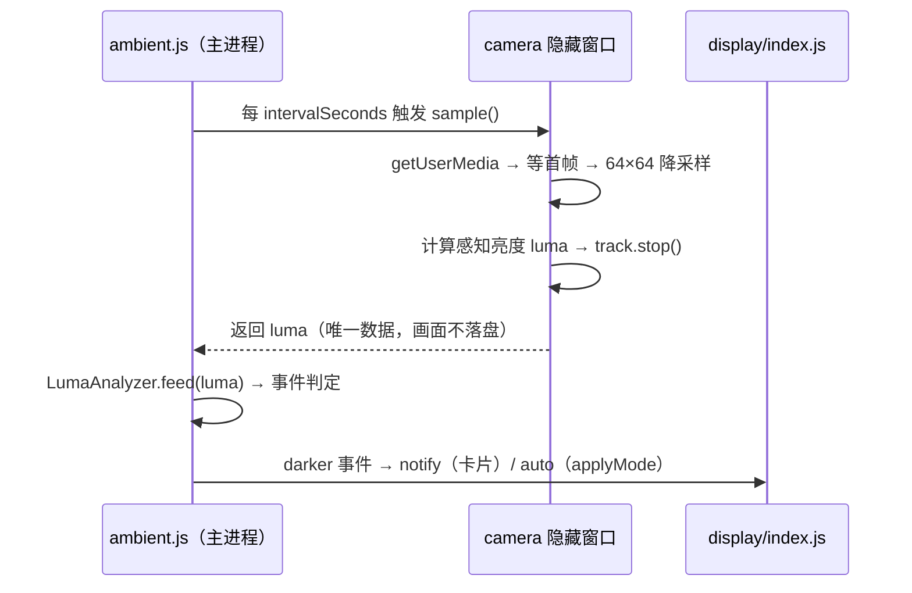
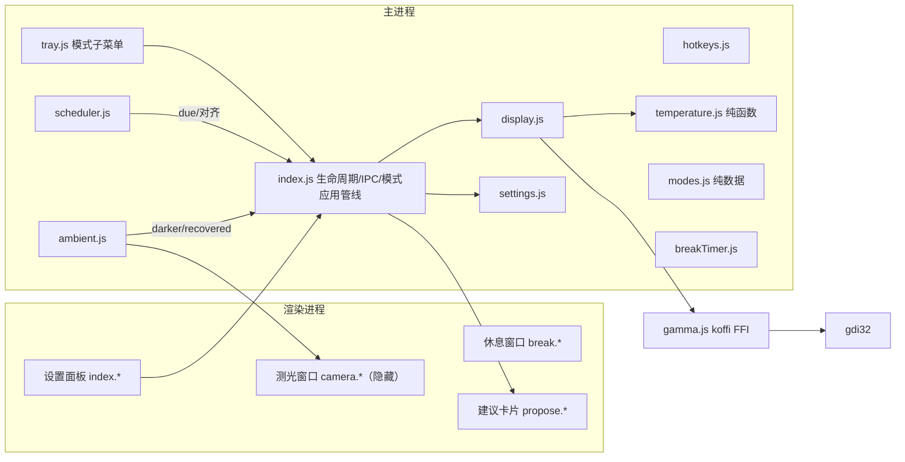

# 护眼助手 v2（EyeGuard v2）— 设计文档（增量）

- 日期：2026-10-01
- 状态：待用户审阅
- 前置：v1 设计 `docs/superpowers/specs/2026-10-01--design.md`（W1–W5 已交付，提交 604a2f7 → f3eb362）
- 本版主题：**主题换肤（深海风）｜ 模式系统（暖↔冷全谱）｜ 时间调度 ｜ 感光提醒**

## 1. 需求提炼

**用户原话**：
1. 「接着优化一下界面，弄得好看一点，搞成网络上那个 deep seek 大肥鱼主题的」
2. 「参考 careueyes 的几种模式可以多借鉴一下，给客户更多选择，我记得他不仅可以调暖色也可以调冷色等等的类似这样」
3. 「能不能加个到点时间自动调节或者到时间询问是否调节到某某模式」
4. 「有没有感光系统？光线暗了就提醒（可以设置）」

**目标**：
- 视觉升级为 DeepSeek「深海蓝」主题（默认），保留暖橙主题可切换。
- 色温调节从「只暖」扩展为 **2000K–10000K 暖↔冷全谱**；预设升级为 7 个场景模式（含冷白提神档）。
- 新增**时间调度**：到点自动切换模式，或弹卡片询问（每条调度可独立配置行为）。
- 新增**感光监测**：摄像头周期测光（本机无环境光传感器，已实机验证替代路径），光线变暗时提醒或自动切换；默认关闭、可设置阈值与间隔。

**非目标（本版不做，YAGNI）**：
- 对比度/灰度调节（gamma LUT 扩展面过大）
- 用户自定义模式（固定 7 档 + 滑块微调）
- 多显示器独立调节（延续 v1 遗留，独立迭代）
- 亮度随环境光**连续自动**调节曲线（感光的 auto 行为只做「切换到某模式」，一次事件一次切换）
- Windows 通知中心集成（自绘卡片，便携版无快捷方式场景下系统通知不可靠）

## 2. 变更总览（相对 v1）

| 模块 | 变更 | 类型 |
|---|---|---|
| `src/main/temperature.js` | 色温域扩至 2000–10000K；冷区反向增益；等效色温反解重构 | 扩展 |
| `src/main/modes.js` | **新增**：7 个场景模式表（纯数据） | 新增 |
| `src/main/scheduler.js` | **新增**：时间调度（纯函数判定 + 定时器壳） | 新增 |
| `src/main/ambient.js` | **新增**：感光监测（测光窗口管理 + 亮度分析） | 新增 |
| `src/renderer/camera.html/js` | **新增**：隐藏测光窗口页面 | 新增 |
| `src/renderer/propose.html/js/css` | **新增**：通用建议卡片窗口（调度询问 / 感光提醒共用） | 新增 |
| `src/renderer/index.*` | 主题换肤、模式网格、调度区、感光区、布局重排 | 重构 |
| `src/renderer/break.*` | 主题变量迁移（跟随主题） | 调整 |
| `src/main/settings.js` | 新增 `theme`/`modeId`/`schedule`/`ambient` 字段 + v1 迁移 | 扩展 |
| `src/main/index.js` | 模式应用管线、调度/感光接线、IPC 扩展、窗口尺寸 | 扩展 |
| `src/main/tray.js` | 模式子菜单（7 档） | 调整 |
| `scripts/make-icon.ps1` | 图标改深海蓝鲸鱼风 | 调整 |
| `tests/*` | temperature 扩展 + modes/scheduler/ambient 新增测试 | 新增 |

## 3. 主题系统（深海风）

### 3.1 双主题

- 默认主题 `deepsea`（DeepSeek 深海蓝风）；备选 `warm`（现值暖橙，原样保留）。
- 实现：CSS 变量契约 + `document.documentElement.dataset.theme`。三个窗口（主面板 / 休息 / 建议卡片）共享同一套变量定义，加载后按设置应用。

**deepsea 变量草案**：

| 变量 | 值 | 用途 |
|---|---|---|
| `--bg` | `#0B0F1A` | 深海夜色底 |
| `--panel` / `--panel-hi` | `#131A2E` / `#182242` | 卡片分层 |
| `--text` | `#E8ECF8` | 正文 |
| `--muted` | `#7C89AC` | 次要文字 |
| `--accent` | `#4D6BFE` | 品牌蓝（DeepSeek 主色） |
| `--accent-soft` | `rgba(77,107,254,0.14)` | 强调软底 |
| `--grad-brand` | `#4D6BFE → #38BDF8` | 品牌渐变（蓝→青） |

### 3.2 品牌元素

- 头部品牌图标：自绘抽象**鲸鱼尾 + 气泡** SVG（风格化线条，不复制 DeepSeek 官方 logo 资源，规避版权）。
- 窗口/托盘图标（`make-icon.ps1` 重画）：深海底 + 蓝色双弧鲸尾或光环，输出 256×256 PNG → 复用现有 `make-ico.js` 转 ICO。
- 色温滑轨升级为**暖↔冷全线渐变**（2000K 琥珀 → 6500K 白 → 10000K 冰蓝），两端与模式档位色点呼应。

## 4. 模式系统（暖↔冷）

### 4.1 色温域扩展（temperature.js）

**现状**：`temperatureGain(K)` 以 6500K 归一，增益 ∈ [0,1]（只衰减）；范围 2000–6500K。

**扩展**：范围 **2000–10000K**，6500K 仍为中性锚点：
- 暖区（≤6500K）：保持现行为（蓝/绿衰减）。
- 冷区（>6500K）：黑体公式 t>66 分支天然给出 `r,g < 255, b = 255`，归一后得 `gain = (r/r₆₅₀₀, g/g₆₅₀₀, 1)`，即**红/绿衰减、蓝保持** —— 视觉即冷色。
  - 参考值：8000K ≈ (0.87, 0.90, 1.0)；10000K ≈ (0.79, 0.86, 1.0)。
- **不变量保持**：`gain(6500) === (1,1,1)` 精确成立（现有单测不动即回归）。

**等效色温反解重构**（`buildSafeLut` 被驱动 50% 规则钳制后需回报实际生效色温）：
- 现有 `kelvinForGainB`（蓝增益二分）仅覆盖暖区；冷区蓝增益恒 1，失去区分度。
- 新增冷区反解 `kelvinForGainR`（红增益在 [6500,10000] 上单调递减，二分）。
- 统一入口 `equivalentKelvin(effGain, brightnessFactor)`：
  ```
  kr = min(1, effGain.r / bf);  kb = min(1, effGain.b / bf)
  if (kb < 1)  → 暖区：kelvinForGainB(kb)      // 蓝被压
  else if (kr < 1) → 冷区：kelvinForGainR(kr)  // 红被压
  else → 6500
  ```
- `buildSafeLut` 的钳制语义不变（保证每通道 max ≥ 32768，牺牲部分色偏换取驱动接受），仅回报值改用新反解。

### 4.2 模式表（modes.js，纯数据）

| id | 名称 | 色温 | 亮度 | 定位 |
|---|---|---|---|---|
| `natural` | 原色 | 6500K | 100% | 不干预（做设计/看图） |
| `focus` | 冷白提神 | 8000K | 100% | 白天困倦提神（冷色档） |
| `office` | 办公 | 5500K | 100% | 办公照明上限（调研 §2.6） |
| `reading` | 阅读暖白 | 5000K | 90% | 纸感、低反差 |
| `evening` | 傍晚 | 4500K | 80% | 日落过渡（f.lux 区间） |
| `night` | 夜晚 | 3400K | 70% | f.lux 默认日落值 |
| `deepnight` | 深夜 | 2700K | 60% | 睡前档（受驱动钳制如实提示） |

- 模式 = { 色温, 亮度 } 的组合；应用管线 `applyMode(modeId)` = `setTemperature(k)` + `setBrightness(b)` + 持久化 `modeId`。
- 手动拖动滑块 → `modeId` 置 `'custom'`（模式网格取消选中）。
- 色温依据沿用 `docs/eye-parameters-research.md`；`focus` 档为冷区新增（依据：白天冷光提高警觉的照明常识方向，标注为产品取舍而非临床结论）。

### 4.3 UI 呈现

- 模式网格：2 列 × 4 行（含自定义态），chip 内显示「名称 + K 值 + 亮度」，选中态用 `--accent` 描边 + 色点（色点按各自色温着色）。
- 精细调节：色温滑块（2000–10000K 步进 100）+ 亮度滑块保留在模式区下方，紧凑化。
- 主窗口尺寸：420×560 → **440×680**（内容重排：模式 / 精细调节 / 休息 / 调度 / 感光 / 通用）。调度与感光的高级参数用 `<details>` 折叠。

## 5. 时间调度（scheduler.js）

### 5.1 数据模型（settings.schedule）

```json
{
  "enabled": false,
  "entries": [
    { "id": "s1", "time": "09:00", "modeId": "office",    "action": "auto", "enabled": true },
    { "id": "s2", "time": "18:00", "modeId": "evening",   "action": "ask",  "enabled": true },
    { "id": "s3", "time": "22:00", "modeId": "night",     "action": "auto", "enabled": true }
  ],
  "lastFired": {}
}
```

- `action`：`auto`（直接应用）｜`ask`（弹建议卡片询问）。
- 默认条目即上表（用户可在 UI 增删改；保底 0 条 = 调度停摆）。

### 5.2 触发语义

- **判定纯函数** `resolveDueEntry(entries, now, lastFired, windowMs=5min) → entry|null`：
  - 条目 due ⟺ `entryTs ≤ now < entryTs + windowMs`（今日时间戳）且 `lastFired[entryId] < entryTs`（本窗口未触发过）。
  - 多条同时 due → 取 `entryTs` 最新者。
  - `windowMs` 容忍 tick 抖动与短睡眠：睡眠唤醒后 5 分钟内仍补触发。
- **防重**：触发即写 `lastFired[entryId] = now`（持久化，跨重启不重复弹）。
- **启动/唤醒对齐**：应用启动与 `powerMonitor` resume 时，取「今天已过的最新条目」：
  - `auto` 型且今日窗口未触发 → 静默应用其模式（错过也补，对齐当前时段）；
  - `ask` 型错过窗口 → 不补弹（避免开机即打扰）。
- **时钟异常防护**：`lastFired` 存时间戳而非仅日期；时钟回拨到窗口外不会误判为「已触发」，回拨到窗口内则由 `lastFired ≥ entryTs` 兜底不重复。
- 生产：`setInterval` 30s tick（分钟粒度双倍采样，保证命中）+ resume 钩子。

### 5.3 建议卡片（propose 窗口）

- 统一卡片窗口 `renderer/propose.*`（400×190 悬浮、不抢焦点 `showInactive`），调度询问与感光提醒共用：
  - 调度：「现在是 22:00 — 切换到『夜晚 3400K』吗？」按钮 [切换] [忽略] [今天不再问]。
  - 「今天不再问」= 将该条目今日窗口标记为已触发。
  - 60 秒无操作自动关闭（视为忽略）。
- 复用 break 窗口的窗口参数模板（frame:false、transparent、alwaysOnTop、skipTaskbar）。

## 6. 感光系统（ambient.js + camera 窗口）

### 6.1 探针结论（2026-10-01 实机，物理证据）

| 断言 | 实测结果 |
|---|---|
| 本机无环境光传感器（ALS） | WMI `MSAcpi_DisplaySensor`/`MSAcpi_AmbientLightSensor` 均未找到；WinRT `LightSensor.GetDefault() = null` |
| 摄像头存在 | `USB webcam (0408:2094)` |
| **隐藏窗口能抓帧** | `show:false + backgroundThrottling:false` 下 `frameOk: true`（4096/4096 非零像素） |
| 权限 handler 必需 | `permissionRequest: media` 触发，`setPermissionRequestHandler` 允许后放行 |
| 开→抓→关全链路 | `openMs=440, totalMs=1554`，`track.stop()` 后 `readyState:"ended"`（干净关闭） |

→ 方案定型：**隐藏测光窗口 + 周期短开摄像头采样**（指示灯闪约 1 秒后熄灭）。

### 6.2 架构与数据流



- 采样间隔默认 60s（可配 30–300s）；单次采样实现期优化为「首帧即抓 + 短稳定延迟」，目标 < 1.2s。
- 失败处理（fail-closed）：无摄像头 / 被占用 / 权限拒绝 → 报错原因、自动停止监测、UI 显示状态；不静默重试轰炸。

### 6.3 判定算法（LumaAnalyzer，纯类，可单测）

- 输入：周期 luma 采样；输出：`darker` / `recovered` / `null` 事件。
- **平滑**：EMA（α=0.3）抗单帧噪声。
- **基线**：最近 60 次采样的 P75 分位（「环境常态亮度」）；**仅 normal 状态下更新**（darker 期间不把黑暗吸进基线，防止基线漂移导致永不触发）。
- **触发**：`smooth < baseline × (1 − dropThreshold/100)` → `darker`（默认阈值 35%）。
- **恢复（回滞）**：`smooth > baseline × (1 − dropThreshold/100 × 0.5)` → `recovered`，回到 normal。
- **冷却**：`darker` 事件间隔 ≥ `cooldownMinutes`（默认 15），normal 期间不计。

### 6.4 行为与设置

```json
{
  "enabled": false,
  "intervalSeconds": 60,
  "dropThresholdPercent": 35,
  "action": "notify",
  "autoModeId": "night",
  "cooldownMinutes": 15
}
```

- `action: "notify"`（默认）：弹建议卡片「环境光线变暗了 — 切换到『夜晚』吗？」[切换] [忽略]。
- `action: "auto"`：直接 `applyMode(autoModeId)`（默认 night），托盘气泡轻提示一次。
- **隐私设计**：默认关闭；开启文案明示「测光时摄像头短暂工作（指示灯约 1 秒），画面仅用于本机计算亮度，不保存、不传输」；采样数据仅 luma 数值。

## 7. 设置结构（v2 增量）

```json
{
  "theme": "deepsea",
  "modeId": "office",
  "schedule": { "enabled": false, "entries": [], "lastFired": {} },
  "ambient": { "enabled": false, "intervalSeconds": 60, "dropThresholdPercent": 35, "action": "notify", "autoModeId": "night", "cooldownMinutes": 15 }
}
```

- v1 → v2 迁移（`settings.load()` 后）：`preset: off→natural / office→office / evening→evening / night→night / deepnight→deepnight / custom→custom`；`modeId` 缺失时按此映射补齐，旧字段保留不动（向前只增不删）。
- `temperature`/`brightness` 继续作为「当前实际值」工作副本（滑块与模式共用）。

## 8. 架构（增量）



**关键接线**：调度与感光都通过 `index.js` 的 `applyMode()` 单一入口落到 display/settings（与手动点击模式共用路径），保证行为一致。

## 9. 测试策略

| 层 | 方法 | 位置 |
|---|---|---|
| 色温冷区/反解 | 单测：`gain(6500)` 恒等保持；冷区单调（8000/10000 参考值）；`equivalentKelvin` 往返（2000–10000 逐档） | `tests/temperature.test.js` 扩展 |
| 模式表 | 单测：id 唯一、色温 ∈ [2000,10000]、亮度 ∈ [50,100] | `tests/modes.test.js` 新增 |
| 调度判定 | 单测（假时钟）：命中/窗口补触发/防重/取最新/跨天/时钟回拨/对齐 | `tests/scheduler.test.js` 新增 |
| 感光分析 | 单测：恒定不触发/骤降触发/不足阈值不触发/回升恢复（回滞）/冷却/基线不吸黑 | `tests/ambientAnalyzer.test.js` 新增 |
| 设置迁移 | 单测：v1 preset→modeId 映射；新字段默认值 | `tests/settings.test.js` 扩展 |
| 摄像头链路 | 集成探针（已跑通，保留于 `.rivet/scratch/camera-probe/`）+ 上机走查 | 脚本 |
| 冷色实机 | `scripts/gamma-selftest.js` 扩展 8000K/10000K 用例 | 脚本 |
| UI 视觉 | `scripts/smoke-shot.js` 截图矩阵（双主题 × 主面板/卡片） | 脚本 + 人工 |

## 10. 波次规划

| 波 | 内容 | 完成判据 |
|---|---|---|
| W6 主题 + 模式核心 | temperature 扩展（冷区+反解）、modes.js、应用管线、UI 换肤（双主题）、图标重画、托盘模式子菜单 | 单测绿 + selftest 冷色用例通过 + 双主题截图走查 + 模式切换实机生效 |
| W7 时间调度 | scheduler.js + 单测、propose 卡片窗口、UI 调度区、启动/唤醒对齐 | 单测绿 + 缩短窗口实测「auto 到点切换 / ask 弹卡」+ 唤醒对齐实测 |
| W8 感光监测 | ambient.js + LumaAnalyzer + camera 窗口、UI 感光区、隐私文案 | 单测绿 + 60s 周期实测（手挡摄像头触发 darker）+ 占用/拒绝路径走查 |
| W9 收尾 | 打包回归、usage.md/README 更新、全量回归 + 三项交付报告 | `npm test` 全绿、selftest exit 0、打包产物走查 |

## 11. 风险与反证清单

| # | 假设/风险 | 等级 | 反证方式 |
|---|---|---|---|
| H6 | 冷色（8000K/10000K）在本机驱动下实际生效（写入成功、effective 如实） | 中 | W6：selftest 扩展冷区用例，检查返回值与读回 |
| H7 | 摄像头 60s 周期运行 30 分钟无泄漏/无卡死；被占用时优雅失败 | 中 | W8：长跑观察 + 中途用其他程序抢占摄像头模拟 |
| H8 | 睡眠唤醒后调度对齐正确（含窗口外错过场景） | 中 | W7：实测唤醒/改系统时间 |
| H9 | deepsea 主题下文字对比度可读（深底 + 蓝强调） | 低 | W6：截图矩阵人工走查（对照 warm） |
| H10 | 隐藏测光窗口不干扰用户（焦点/任务栏/游戏） | 中 | W8：全屏应用 + 游戏时观察 |
| H11 | 「今天不再问」与冷却状态跨重启不重复打扰 | 低 | W7：重启后仍不重弹 |

## 12. 附录：v2 设置默认值（完整）

```json
{
  "enabled": true,
  "temperature": 6500,
  "brightness": 100,
  "modeId": "natural",
  "theme": "deepsea",
  "breaks": { "enabled": true, "workSeconds": 1200, "breakSeconds": 20, "style": "gentle" },
  "hotkeys": { "tempUp": "Control+Alt+Up", "tempDown": "Control+Alt+Down" },
  "autoLaunch": false,
  "pausedUntil": null,
  "schedule": {
    "enabled": false,
    "entries": [
      { "id": "s1", "time": "09:00", "modeId": "office",  "action": "auto", "enabled": true },
      { "id": "s2", "time": "18:00", "modeId": "evening", "action": "ask",  "enabled": true },
      { "id": "s3", "time": "22:00", "modeId": "night",   "action": "auto", "enabled": true }
    ],
    "lastFired": {}
  },
  "ambient": {
    "enabled": false,
    "intervalSeconds": 60,
    "dropThresholdPercent": 35,
    "action": "notify",
    "autoModeId": "night",
    "cooldownMinutes": 15
  }
}
```
